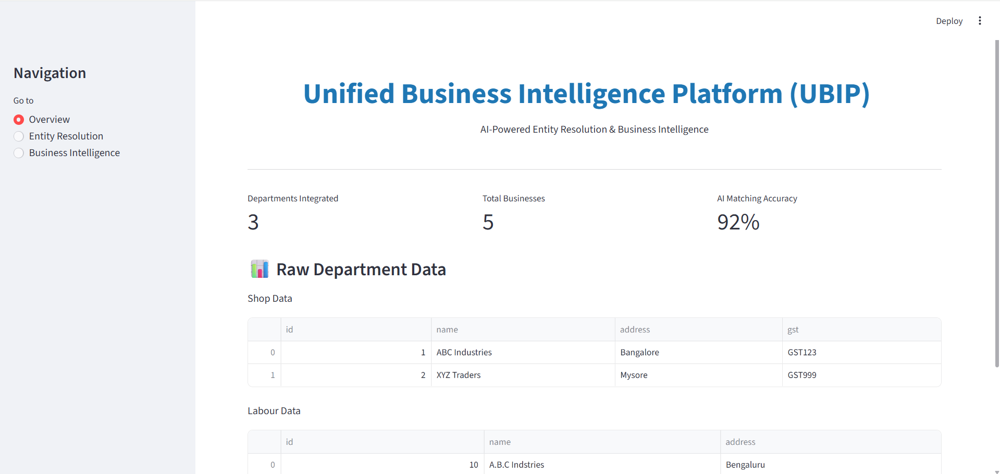
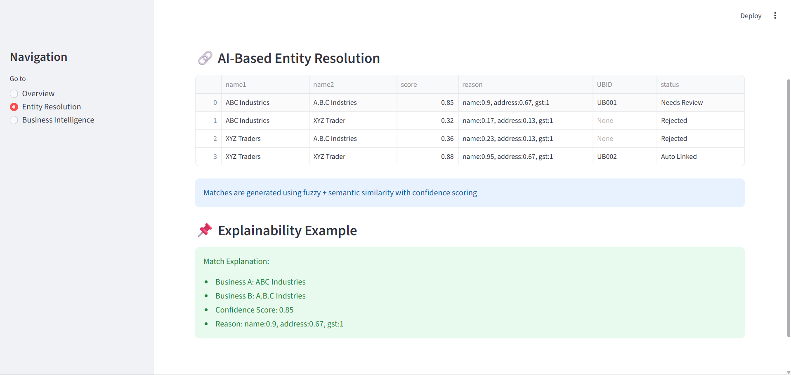
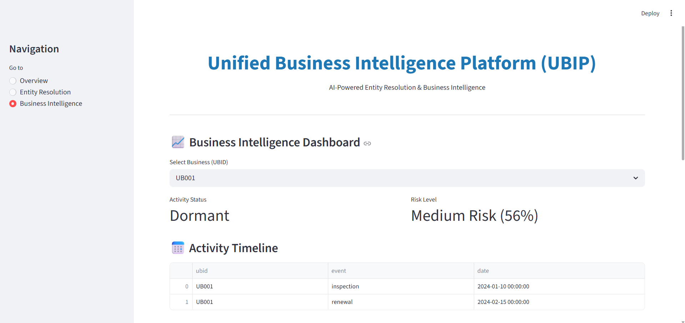
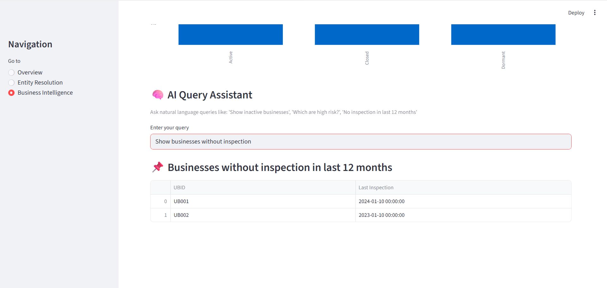
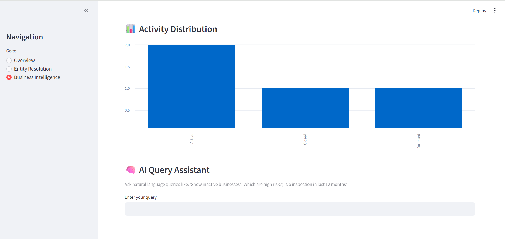

# 🚀 UBIP – Unified Business Intelligence Platform

## 📌 Overview

UBIP (Unified Business Intelligence Platform) is an AI-powered system designed to solve the problem of fragmented business data across multiple government departments.

It intelligently links records belonging to the same business, generates a unified identity (UBID), analyzes activity patterns, and provides predictive insights to enable data-driven governance.

👉 **From fragmented data → unified, intelligent decision-making**

---

## 🎯 Problem Statement

Government systems operate in silos, leading to:

- Duplicate and inconsistent business records  
- No unified identifier across departments  
- Lack of visibility into business activity  
- Inefficient compliance monitoring  
- Delayed and reactive decision-making  

---

## 💡 Solution

UBIP introduces an intelligent pipeline that:

- Links business records using AI-based entity resolution  
- Assigns a **Unique Business Identifier (UBID)**  
- Provides **confidence scoring with explainability**  
- Tracks business activity over time  
- Predicts risk and future behavior  
- Enables natural language querying for insights  

---

## 🧠 Key Features

### 🔗 AI-Based Entity Resolution
- Matches records across departments  
- Handles name/address variations and inconsistencies  

### 📊 Explainable Matching
- Each match includes a confidence score  
- Provides reasoning (name similarity, address match, etc.)  

### 📈 Business Activity Intelligence
- Classifies businesses as:
  - Active  
  - Dormant  
  - Closed  

### 🔥 Predictive Risk Analysis
- Identifies businesses likely to become inactive or non-compliant  
- Enables proactive governance  

### 🧠 AI Query Assistant
- Supports natural language queries such as:
  - “Show inactive businesses”  
  - “Which businesses need inspection?”  
  - “High risk businesses”  

---

## 🏗️ System Architecture

The system follows a modular pipeline:
Data Sources → Entity Resolution → UBID → Activity Intelligence → Prediction → Dashboard

- Modular and scalable  
- Non-intrusive (no changes to existing systems required)  
- Fully explainable decision pipeline  

---

## 📁 Project Structure
UBIP/
│
├── data/ → Sample datasets
├── modules/ → Core AI and logic modules
├── app.py → Main Streamlit dashboard
├── requirements.txt
└── README.md

---

## ⚙️ Tech Stack

- **Python**
- **Streamlit** (Frontend + Dashboard)
- **Pandas** (Data processing)
- **RapidFuzz** (Fuzzy matching)
- **Scikit-learn** (Prediction logic)

---

## ▶️ How to Run

### 1. Clone the repository
git clone https://github.com/your-username/UBIP-AI-Business-Intelligence-Platform.git

### 2. Navigate to the project folder
cd UBIP-AI-Business-Intelligence-Platform

### 3. Install dependencies
pip install -r requirements.txt

### 4. Run the application
streamlit run app.py
OR
python -m streamlit run app.py

---

## 🎥 Demo Workflow

1. Load sample department data  
2. Perform AI-based entity resolution  
3. View confidence scores and explanations  
4. Analyze business activity and status  
5. Generate predictive risk insights  
6. Query system using natural language  

---

## 📸 Screenshots

### Dashboard

### Entity Resolution

###More Screenshots 

---

## 🌍 Real-World Impact

- Identify active vs inactive businesses  
- Detect compliance gaps and inspection delays  
- Enable targeted inspections  
- Improve decision-making efficiency  
- Increase transparency in governance  

---

## 🚀 Scalability

- Can integrate across multiple departments  
- Works as a non-intrusive overlay system  
- Scalable to state and national-level deployment  

---

## 🔒 Compliance & Safety

- Uses synthetic/sample data  
- No real personal data is used  
- Fully explainable AI decisions  
- Supports human-in-the-loop validation  

---

## 🏁 Conclusion

UBIP is not just a data integration tool—it is an intelligent decision-support system that combines AI-driven entity resolution, explainable analytics, and predictive intelligence to transform governance.

**We don’t just connect data — we generate intelligence and predict behavior**

---
